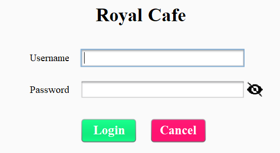

# Cafe-Management
### Project Name: Cafe Management System
### Language: Java Swing 
### IDE: Apache Netbeans IDE

In this Cafe Management System Java Project design with Net-Beans IDE Using Java Swing. Cafe operator will take customers orders and the system calculates the total amount of purchase including tax and also print the receipt.  
This system will save time and it will be easy to use when compared to manual work that was done on paper. Cafe Management system reduces manual work and improves efficiency and rate of work. It is specifically designed for cafe billing management and order-taking management system. 

### Login
<h2 align="center">
   
</h2>

### Dashboard
<h2 align="center">
   
</h2>
<h2 align="center">
   
</h2>

### <a href='https://youtu.be/N0n3PYCq94E'>View Demo</a>
